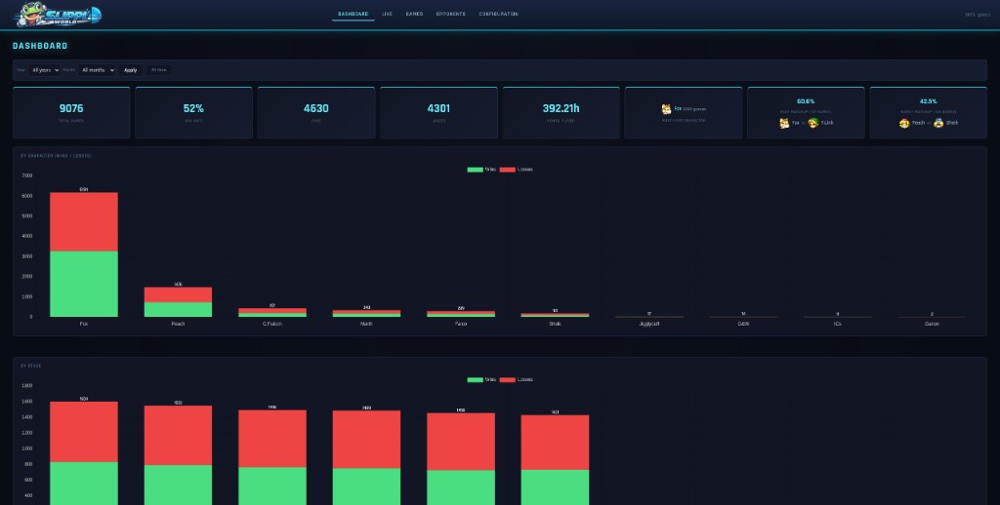
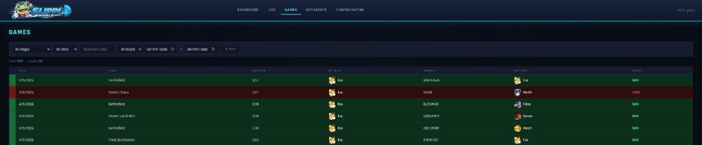
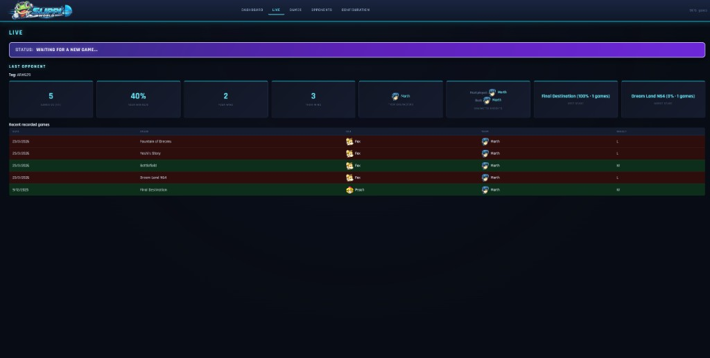
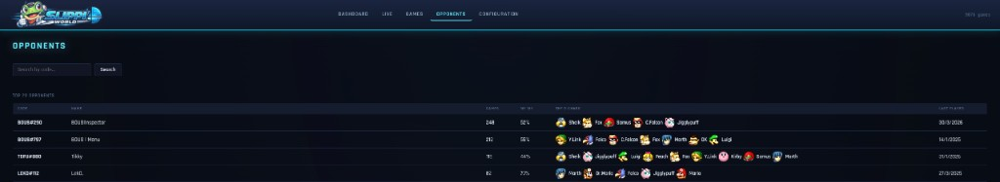

# Slippi World

Slippi World is a local app for analyzing Slippi replay data with dashboards, opponent insights, live context, and searchable match history.

The app runs fully on your machine using Bun + SQLite.

## Features

- Dashboard stats, trends, and your current/best Slippi ranked info
- LIVE opponent insights while playing, including current and best ranked data
- Games view with filters and infinite scroll
- Opponents page with top and recent tags, plus ranked columns (rank + ELO)
- Configuration page for connect codes, replay folders, and ingest

## Screenshots

### Dashboard


### Games


### LIVE


### Opponents


## Tech Stack

- [Bun](https://bun.com) runtime and bundler
- TypeScript backend
- SQLite database
- Vanilla JS frontend + Chart.js

## Requirements

- Bun `>= 1.3.x`
- Slippi replay folders (`.slp`)

## Quick Start

```bash
bun install
bun run dev
```
Open `http://localhost:7474`.

Or use the Github Releases to install the app:

## GitHub Releases 

For releases, publish binaries as GitHub Release assets:

- `SlippiWorld-linux-x64.AppImage`
- `SlippiWorld-Setup.exe`
- `SlippiWorld-windows-x64.zip`
- `SlippiWorld-macos-x64.zip`
- `SlippiWorld-macos-arm64.zip`

## How It Works

1. Add your connect code(s) and replay directories in **Configuration**.
2. Run **Ingest** to import games into the local database.
3. Use **Dashboard**, **Games**, **Opponents**, and **Live** for analysis in real time.

## Data Location

By default, the app stores SQLite data in OS-native paths:

- Linux: `~/.local/share/slippi-world/slippi-world.db`
- Windows: `%APPDATA%/slippi-world/slippi-world.db`

You can override it in Linux:

```bash
DB_PATH=/custom/path/slippi-world.db ./dist/slippi-world-linux-x64
```